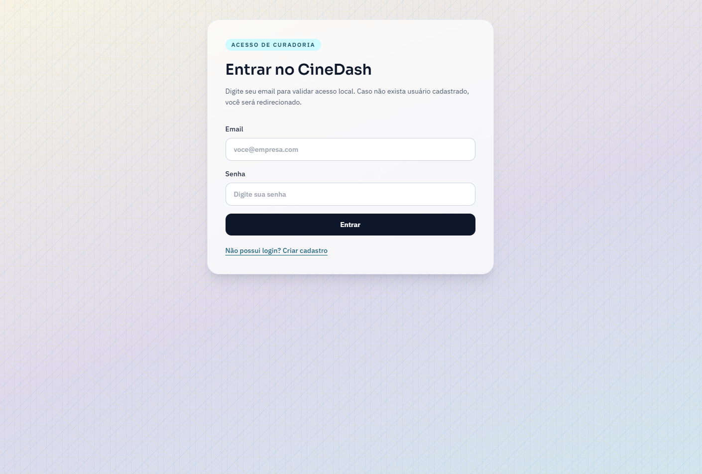
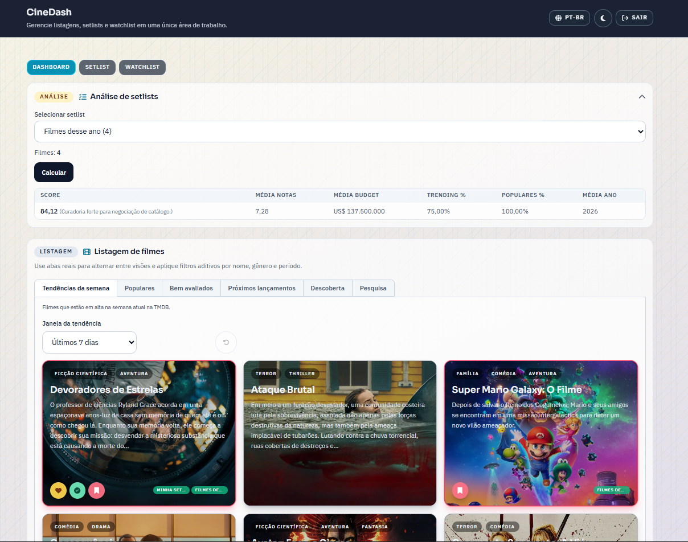
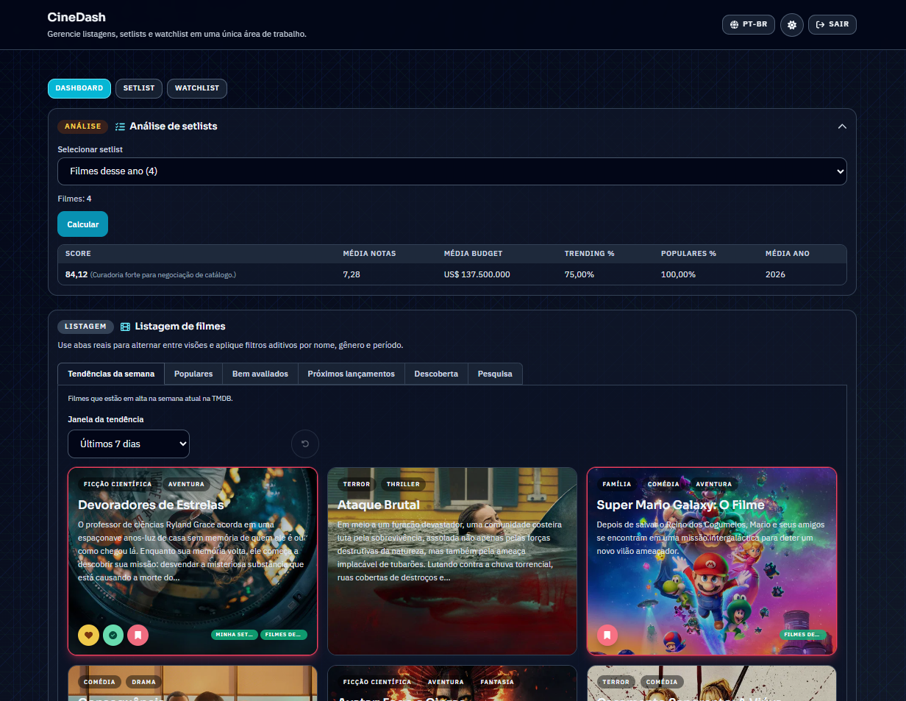
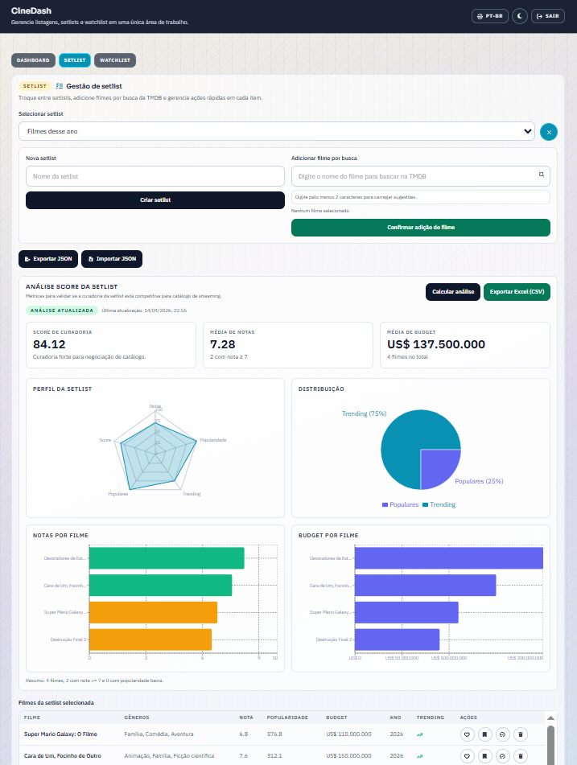
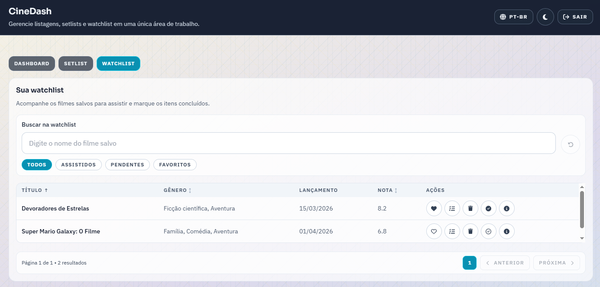

# CineDash

Implementação do desafio **CineDash (filmes)** com foco em arquitetura modular, estado previsível e UX consistente para curadoria de catálogo.

## Projeto escolhido

- Caso escolhido: **01-cinedash.md**
- Stack principal: React + TypeScript + Vite + TanStack Query + TanStack Router + Zustand + React Hook Form + Zod + i18n + Tailwind

## Funcionalidades implementadas

- Autenticação simulada com sessão expirada por tempo e persistência local.
- Guardas de rota para proteger área autenticada e para sincronizar idioma da URL.
- Dashboard de descoberta com abas (tendências, populares, bem avaliados, próximos lançamentos, descoberta e pesquisa).
- Filtros com debounce (busca, gênero, ano, nota mínima, região, ordenação e janela de tendência).
- Watchlist e favoritos persistidos por usuário.
- Setlists com manipulação local, busca de filmes e associações por filme.
- Detalhes do filme com rota dinâmica, elenco e trailer (quando disponível).
- Tema light/dark persistido com estratégia `darkMode: 'class'`.

## Funcionalidades extras

- Análise de setlist com score de curadoria e exportação em CSV.
- Importação e exportação de dados do usuário em JSON.
- Toasts de feedback para operações principais.
- Sincronização automática de idioma na rota e na camada de i18n.

## Prints da aplicação

### Tela de login



### Dashboard de filmes



### Dashboard de filmes em modo escuro



### Setlist e análise



### Watchlist



## Como executar

### Requisitos

- Node.js 20+
- npm 10+

### Passos

1. Instale dependências:

```bash
npm install
```

2. Configure variáveis de ambiente em um arquivo `.env`:

```env
VITE_TMDB_API_READ_ACCESS_TOKEN=seu_token_de_leitura_tmdb
# opcional
VITE_TMDB_API_KEY=sua_api_key_tmdb
# opcional, padrão já configurado para a API pública oficial
VITE_TMDB_API_URL=https://api.themoviedb.org/3
```

3. Rode o projeto:

```bash
npm run dev
```

## Scripts

- `npm run dev`: sobe ambiente de desenvolvimento.
- `npm run build`: valida TypeScript e gera build de produção.
- `npm run preview`: sobe preview da build.
- `npm run lint`: executa ESLint.
- `npm run test`: executa suíte de testes (Vitest).
- `npm run test:watch`: executa testes em watch mode.

## Bibliotecas instaladas e motivo

### Dependências de runtime

| Biblioteca | Motivo da instalação |
| --- | --- |
| `@hookform/resolvers` | Integração entre React Hook Form e Zod nas validações de formulário. |
| `@tanstack/react-query` | Cache e orquestração de estado assíncrono (TMDB e fluxo de auth mock). |
| `@tanstack/react-router` | Roteamento tipado com guardas por idioma e sessão. |
| `@tanstack/react-table` | Instalada para a abordagem de tabelas complexas (diferencial pedido), mantida para evolução da tabela da watchlist/setlist. |
| `autoprefixer` | Compatibilidade de CSS entre navegadores no pipeline do Tailwind/PostCSS. |
| `i18next` | Motor central de internacionalização. |
| `postcss` | Processamento de CSS usado junto com Tailwind e Autoprefixer. |
| `react` | Biblioteca base da interface. |
| `react-dom` | Renderização web da aplicação React. |
| `react-hook-form` | Gerenciamento de formulários com foco em performance e simplicidade. |
| `react-i18next` | Bindings React para tradução e troca de idioma. |
| `react-icons` | Biblioteca auxiliar para iconografia dos componentes de ação e navegação. |
| `recharts` | Biblioteca auxiliar para visualizações de dados no dashboard de análise de setlist. |
| `zod` | Contratos de validação para formulários e dados internos. |
| `zustand` | Estado global leve com persistência e foco em previsibilidade. |

### Dependências de desenvolvimento

| Biblioteca | Motivo da instalação |
| --- | --- |
| `@eslint/js` | Configuração base moderna do ESLint. |
| `@tailwindcss/container-queries` | Suporte a container queries no Tailwind para responsividade por container. |
| `@testing-library/jest-dom` | Matchers adicionais para asserções de UI em testes. |
| `@testing-library/react` | Ferramentas de teste de componentes React focadas no comportamento do usuário. |
| `@types/node` | Tipagens Node para ferramentas e ambiente de build/teste. |
| `@types/react` | Tipagens React para TypeScript. |
| `@types/react-dom` | Tipagens React DOM para TypeScript. |
| `@vitejs/plugin-react` | Plugin oficial do React para Vite (HMR e transformações). |
| `eslint` | Linting do projeto. |
| `eslint-plugin-react-hooks` | Regras de consistência para hooks. |
| `eslint-plugin-react-refresh` | Regras de compatibilidade com React Refresh no Vite. |
| `globals` | Conjunto padrão de globais para configuração do lint. |
| `jsdom` | Ambiente DOM para execução de testes no Vitest. |
| `tailwindcss` | Framework utilitário de estilos. |
| `typescript` | Tipagem estática e validação em build. |
| `typescript-eslint` | Integração de regras ESLint com TypeScript. |
| `vite` | Bundler e servidor de desenvolvimento. |
| `vitest` | Runner de testes unitários e integração. |

## Nota sobre biblioteca de componentes

Neste ciclo eu **não adotei uma biblioteca completa de componentes como Ant Design, PrimeNG, etc**.

No início do desafio, fiquei com a impressão de que o uso de uma biblioteca de componentes base poderia não ser permitido no contexto da avaliação, então preferi seguir com componentes próprios e classes utilitárias.

Conforme o projeto evoluiu, passei a usar bibliotecas **auxiliares** em pontos específicos, como:

- `react-icons` para iconografia;
- `recharts` para os gráficos de análise.

## Documentação complementar

- Veja decisões de arquitetura em `ARCHITECTURE.md`.
- Veja instruções objetivas de execução em `INSTRUCTIONS.md`.
